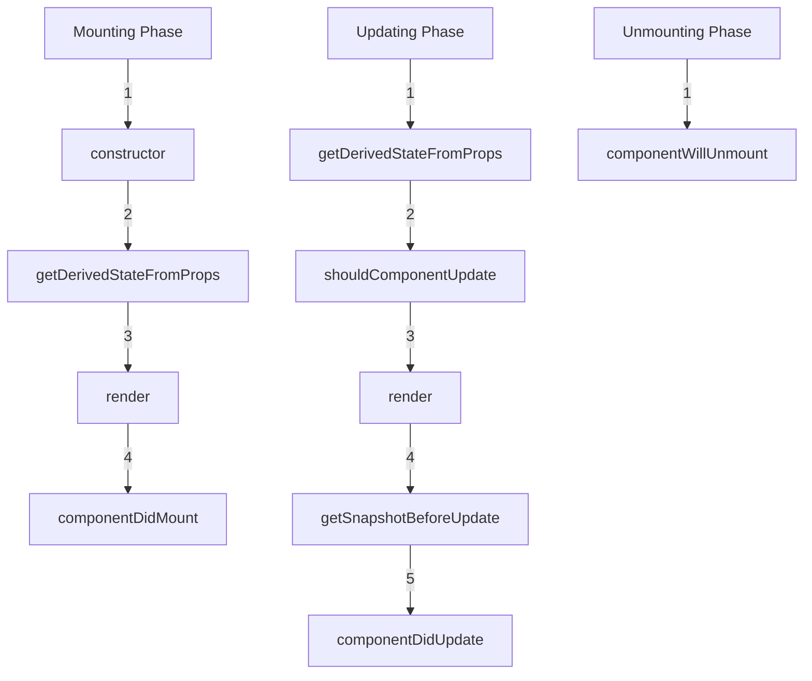

Here is a **styled README.md** that explains the **React Component Lifecycle**:

```md
# React Component Lifecycle

In React, a component's lifecycle refers to the different stages it goes through during its existence — from its initialization to its removal from the DOM. Understanding the lifecycle is essential to managing how your component interacts with the DOM, performs side-effects, and handles updates.

## 1. Phases of Component Lifecycle

The component lifecycle can be divided into three main phases:

1. **Mounting** - When the component is being created and inserted into the DOM.
2. **Updating** - When the component is being re-rendered due to changes in state or props.
3. **Unmounting** - When the component is being removed from the DOM.

---

## 2. Lifecycle Methods in Each Phase

### 1. **Mounting Phase**

Lifecycle methods involved during the mounting process:

- **`constructor(props)`**
  - Initializes the component state and binds event handlers.

- **`static getDerivedStateFromProps(props, state)`**
  - Synchronizes state with props if necessary before rendering. It's rarely used and is static, meaning it doesn't have access to `this`.

- **`render()`**
  - The only required method in a class component, responsible for describing the UI.

- **`componentDidMount()`**
  - Called after the component is mounted into the DOM. Best place to make network requests or subscribe to external events.

### 2. **Updating Phase**

Lifecycle methods involved during updates (when props or state changes):

- **`static getDerivedStateFromProps(props, state)`**
  - Same as in the mounting phase. It's called before every re-render if the component's props have changed.

- **`shouldComponentUpdate(nextProps, nextState)`**
  - Determines whether the component should re-render. Returns `true` by default but can be optimized to return `false` for specific scenarios.

- **`render()`**
  - Called again to re-render the component with the updated state or props.

- **`getSnapshotBeforeUpdate(prevProps, prevState)`**
  - Called right before the DOM is updated, and can be used to capture information from the DOM before changes (e.g., scroll position).

- **`componentDidUpdate(prevProps, prevState, snapshot)`**
  - Called after the component has been updated and the DOM has been re-rendered. A common place to interact with external APIs or perform DOM manipulations based on the changes.

### 3. **Unmounting Phase**

Lifecycle method involved during unmounting:

- **`componentWillUnmount()`**
  - Invoked before the component is removed from the DOM. Clean up subscriptions, timers, or other resources here.

---

## 3. Order of Lifecycle Methods

### **Mounting:**
1. `constructor(props)`
2. `static getDerivedStateFromProps(props, state)`
3. `render()`
4. `componentDidMount()`

### **Updating (due to props or state change):**
1. `static getDerivedStateFromProps(props, state)`
2. `shouldComponentUpdate(nextProps, nextState)`
3. `render()`
4. `getSnapshotBeforeUpdate(prevProps, prevState)`
5. `componentDidUpdate(prevProps, prevState, snapshot)`

### **Unmounting:**
1. `componentWillUnmount()`

---

## 4. Side-Effects in Lifecycle Methods

**Side-effects** (e.g., fetching data, manipulating the DOM, subscriptions) should be carefully placed in lifecycle methods to avoid unnecessary re-renders or memory leaks.

- **`componentDidMount()`**:
  - Best place to perform initial side-effects such as fetching data or setting up subscriptions.
  - Example:
    ```js
    componentDidMount() {
      fetchData().then(response => this.setState({ data: response }));
    }
    ```

- **`componentDidUpdate()`**:
  - Best for running side-effects in response to prop or state changes. You can compare the previous props and state to ensure the side-effect only runs when necessary.
  - Example:
    ```js
    componentDidUpdate(prevProps) {
      if (prevProps.userId !== this.props.userId) {
        this.fetchUserData(this.props.userId);
      }
    }
    ```

- **`componentWillUnmount()`**:
  - Perfect for cleaning up side-effects like removing event listeners or clearing timers to avoid memory leaks.
  - Example:
    ```js
    componentWillUnmount() {
      clearInterval(this.timer);
    }
    ```

---

## Visualizing Lifecycle Phases



---

## Best Practices for Using Lifecycle Methods

- Use **`constructor`** sparingly, typically only to initialize state.
- Perform **side-effects** (API calls, subscriptions) in **`componentDidMount`**.
- Use **`componentDidUpdate`** to act upon prop or state changes.
- Clean up resources in **`componentWillUnmount`**.
- Consider using **React Hooks** (`useEffect`) for functional components, which simplify lifecycle management.

---

## Additional Resources

- [React Documentation on Lifecycle Methods](https://reactjs.org/docs/react-component.html)
- [React Hooks](https://reactjs.org/docs/hooks-intro.html) – A modern alternative for managing lifecycle in functional components.
```

This README provides a structured overview of React component lifecycle methods, their order of execution, and best practices for managing side-effects. The **mermaid** diagram adds a visual representation of the lifecycle phases, and code snippets provide examples for clarity.